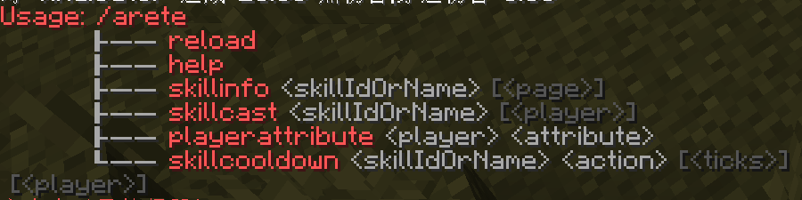

# 命令列表

## <>必填，[]选题，[<>] 根据前面命令的不同,有时选填有时必填
/arete reload - 重载配置并且清除技能缓存

/arete help - 命令帮助

/arete skillinfo <技能id或技能名> [页码] - 查看技能信息

/arete skillcast <技能id或技能名> [玩家名] - 释放指定技能

/arete playerattribute <玩家名> <属性名> - 修改玩家属性(仅作技能测试后修复用)

/arete skillcooldown <技能id或技能名> <操作> [<ticks>] [玩家名] - 操作玩家技能冷却

> 更新: 2025-10-17 00:59:59  
> 原文: <https://www.yuque.com/yuazer/blow95/gwpenariqif4iffr>